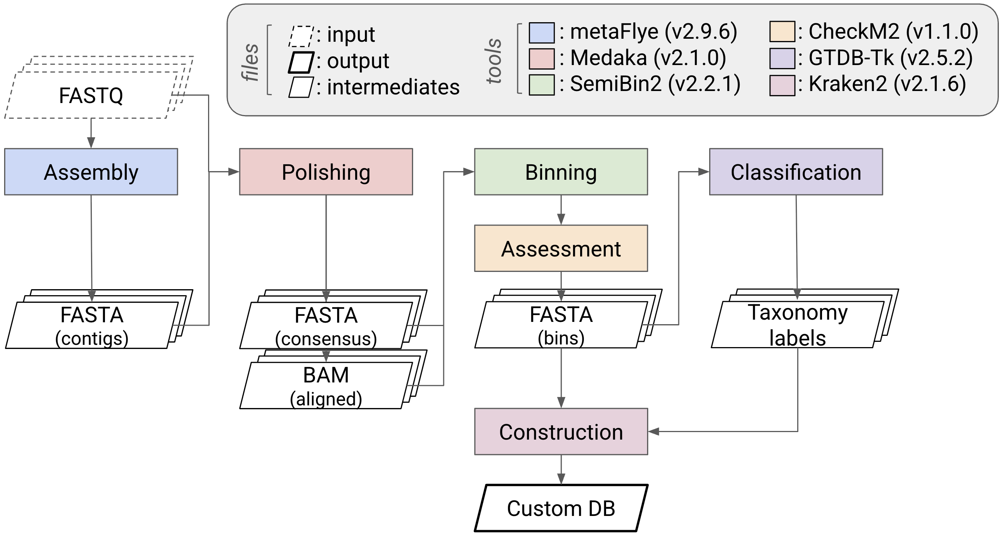

# Creating a custom reference DB
> Long-read metagenomic assembly, MAG recovery, and custom Kraken2 database construction

## Rationale

Human microbiota-associated mouse models require accurate measurement of microbial engraftment. However, standard taxonomic databases contain many irrelevant taxa, which increases the chance of misclassification in germ-free mice colonized with human samples.

By generating assemblies and MAGs directly from donor metagenomes:
  * The search space is narrowed to taxa that are biologically expected
  * Detection sensitivity increases
  * False positives decrease
  * Reproducibility is enhanced

Using donor-derived metagenomes reduces the search space to biologically relevant taxa and avoids false positives that arise from using large, generic reference databases.

## Workflows

1.  **Assembly and polishing**: Generate high-quality assemblies from long-read metagenomic data.
2.  **Binning**: Recover MAGs through polishing and binning.
3.  **Quality assessment**: Evaluate genome quality using standardized criteria.
4.  **Taxonomy classification**: Assign taxonomy and obtain their genomes.
5.  **Construction**: Build a custom Kraken2 database tailored to the microbial community of interest.

### Environment setup
Before running the pipeline, set the following environment variables to define input locations, output directories, and software paths.

```bash
# Define base folders
export FASTQ_FOLDER=/path/to/fastq
export ASSEMBLY_FOLDER=/path/to/assembly
export MEDAKA_FOLDER=/path/to/medaka
export BIN_FOLDER=/path/to/bins
export CHECKM2_FOLDER=/path/to/checkm2
export GTDBTK_FOLDER=/path/to/gtdbtk
export REF_FOLDER=/path/to/references
export CUSTOMDB_FOLDER=/path/to/custom_db
```

Make sure all tools are installed and available in your system `PATH`, or update the variables to their absolute paths.

### Dependencies

Install or load the following tools before execution:

| Tool | Purpose | Reference |
|------|----------|------------|
| [metaFlye](https://github.com/mikolmogorov/Flye) | Long-read metagenomic assembly | Kolmogorov et al. |
| [Medaka](https://github.com/nanoporetech/medaka) | ONT assembly polishing (consensus correction) | Oxford Nanopore Technologies |
| [SemiBin2](https://github.com/BigDataBiology/SemiBin) | Metagenomic binning using machine learning–based clustering | Pan et al. |
| [CheckM2](https://github.com/chklovski/CheckM2) | MAG quality assessment (completeness and contamination) | Chklovski et al. |
| [GTDB-Tk](https://github.com/Ecogenomics/GTDBTk) | Taxonomic classification of MAGs using the GTDB database | Chaumeil et al. |
| [Kraken2](https://github.com/DerrickWood/kraken2) | High-throughput taxonomic classification of sequencing reads | Wood et al. |

### Example directory structure
```bash
├── fastq/                  # Raw FASTQ input files
├── assembly/               # metaFlye assemblies
├── medaka/                 # Polished assemblies
├── bins/                   # SemiBin2 bins (MAGs)
├── checkm2/                # CheckM2 outputs
├── gtdbtk/                 # GTDB-Tk taxonomy outputs
├── references/             # GenBank reference genomes
└── custom_db/              # Final Kraken2 custom database
```

### Schematic overview




### Pipeline steps
#### Step 01. Assembly with metaFlye
```bash
flye --nano-hq $FASTQ_FOLDER/F0.fastq.gz --out-dir $ASSEMBLY_FOLDER/F0 --meta
```

#### Step 02. Polishing with Medaka

Dorado and Medaka are both developed by Oxford Nanopore Technologies; however, their model naming conventions are not fully consistent across applications. For example, the same model may appear as:
  * dna_r10.4.1_e8.2_400bps_sup@v5.2.0
  * r1041_e82_400bps_sup_v5.2.0

```bash
medaka_consensus -i $FASTQ_FOLDER/F0.fastq.gz -d $ASSEMBLY_FOLDER/F0/assembly.fasta -o $MEDAKA_FOLDER -m r1041_e82_400bps_sup_v5.2.0
```

### Step 03. Binning with SemiBin2

```bash
SemiBin2 single_easy_bin -i $MEDAKA_FOLDER/F0/consensus.fasta -b $MEDAKA_FOLDER/F0/calls_to_draft.bam -o $BIN_FOLDER/F0 --environment human_gut --sequencing-type long_read
```

### Step 04. Quality assessment with CheckM2

```bash
export CHECKM2DB="$REF_FOLDER/uniref100.KO.1.dmnd"
checkm2 predict -i $BIN_FOLDER$/F0/output_bins --output_directory $CHECKM2_FOLDER/F0 -x fa.gz
```

### Step 05. Taxonomic classification with GTDB-Tk

```bash
gtdbtk classify_wf --genome_dir $BIN_FOLDER/F0/fasta_passed --out_dir $GTDBTK_FOLDER/F0 --extension fa.gz
```

### Step 06. Download genomes and add Kraken2 header

```bash
datasets download genome accession GCA_XXXXX --include genome --filename GCA_XXXXX.zip
```

Then, add header:

    >sequence_id |kraken:taxid|XXXXXX

### Step 07. Build custom Kraken2 DB
```bash
cd $CUSTOMDB_FOLDER
k2 download-taxonomy --db myDB
k2 add-to-library --file GCA_XXXXX.fasta --db myDB
k2 build --db myDB
```

---
