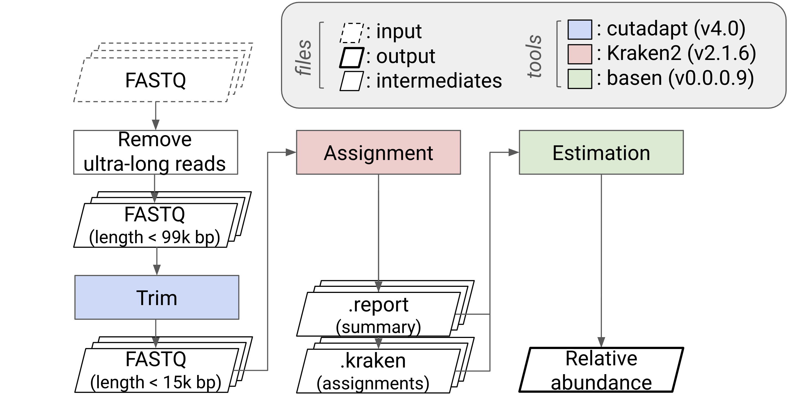

# Taxonomic Classification
> Read-level taxonomic assignment and abundance profiling using a custom Kraken2 database

## Rationale
Accurate taxonomic profiling of the long-read metagenomic data requires both high-quality reads and context-aware reference databases. Long-read sequencing introduces higher base error rates, and naïve classification against large, generic databases can lead to ambiguous assignments and inflated false positives.

This module ensures robust and reproducible estimation of microbial composition and engraftment dynamics:
  * Reduces misclassification caused by sequencing errors
  * Eliminates spurious taxa absent from the biological system
  * Improves abundance estimation accuracy
  * Enhances interpretability in engraftment and colonization studies

## Workflows

1. **Read preprocessing**: Remove low-quality and ultra-long reads
2. **Taxonomic classification**: Assign reads using Kraken2 with a custom database
3. **Confidence filtering**: Retain only high-confidence read assignments
4. **Quantification**: Estimate taxon-level coverage and relative abundance

### Environment setup
Set the following environment variables to define input data, outputs, and database locations.

```bash
# Define base folders
export FASTQ_FOLDER=/path/to/fastq
export FILTERED_FOLDER=/path/to/filtered_reads
export CLASSIFICATION_FOLDER=/path/to/kraken2
export CUSTOMDB_FOLDER=/path/to/custom_db
export PROFILE_FOLDER=/path/to/basen
```

### Dependencies

Install or load the following tools prior to execution:

| Tool | Purpose | Reference |
|------|----------|------------|
| [cutadapt](https://cutadapt.readthedocs.io/) | Trimming reads to a specified length | Martin |
| [Kraken2](https://github.com/DerrickWood/kraken2) | High-throughput taxonomic classification of sequencing reads | Wood et al. |
| [basen](https://github.com/Snyder-Institute/basen) | Base-level Abundance estimation with Species-assigned Evidence | _Not published_ |

### Example directory structure
```bash
├── fastq/                  # Input FASTQ files
├── filtered_reads/         # Quality- and length-filtered reads
├── kraken2/                # Kraken2 classification outputs
├── custom_db/              # Custom Kraken2 database
└── basen/                  # Relative abundance profiles
```

### Schematic overview



### Pipeline steps
#### Step 01. Read preprocessing and filtering
The selection of filtering thresholds is inherently arbitrary and can substantially influence downstream analyses. Therefore, we recommend that users justify cutoff values based on empirical evidence derived from their own data.

To inform our filtering strategy, we evaluated per-base read quality across read-length bins defined as follows: 1–999 bp, 1,000–9,999 bp, 10,000–99,999 bp (long reads), and ≥100,000 bp (ultra-long reads). This analysis revealed two notable patterns: (1) ultra-long reads exhibited a pronounced decline in base quality after the first 5–10 bases, and (2) long reads showed a marked decrease in base quality beyond approximately 15,000 bp. Based on these observations, we chose to discard ultra-long reads entirely and to trim long reads to a maximum length of 15,000 bp.

With respect to read quality filtering, Dorado discards reads with a mean Phred quality score below 20. Given that our length-based filtering and trimming strategy substantially improved overall read quality, we did not apply additional quality-based filtering steps.

The code below implements the removal of ultra-long reads and the trimming of long reads according to the criteria described above.

```bash
cutadapt -l 14999 -o $FILTERED_FOLDER/F0_10000-15000.fastq.gz $FASTQ_FOLDER/F0_10000-99999.fastq.gz
rm $FASTQ_FOLDER/F0_gtet100000.fastq.gz # gtet, greater than or equal to
cat $FASTQ_FOLDER/F0_1-999.fastq.gz $FASTQ_FOLDER/F0_1000-9999.fastq.gz $FILTERED_FOLDER/F0_10000-15000.fastq.gz > $FILTERED_FOLDER/F0.fastq.gz
```

#### Step 02. Taxonomic classification with Kraken2

Filtered reads are classified against the custom Kraken2 database generated from donor-derived MAGs.

```bash
k2 classify \
  --db $CUSTOMDB_FOLDER \
  --threads 16 \
  --report $CLASSIFICATION_FOLDER/F0.report \
  --output $CLASSIFICATION_FOLDER/F0.kraken \
  $FILTERED_FOLDER/F0.fastq.gz
```

#### Step 03. Confidence-based read filtering

We evaluated taxonomic classification accuracy using a defined positive control dataset, OMM12 (oligo-mouse microbiota), through comparative benchmarking of Kraken2 and Minimap2 coupled with CoverM. Each method was tested against two custom reference databases: (i) OMM12 alone and (ii) OMM12 augmented with decoy genomes (e.g., the human reference genome).

This benchmarking revealed two key patterns. First, Kraken2 produced more reliable taxonomic assignments than Minimap2 when validated against BLAST results. This discrepancy is likely attributable to Minimap2’s reliance on minimizers as alignment anchors; loss of these anchors can disrupt chaining and result in missed alignments, particularly in repetitive genomic regions. Second, we conducted _k_-mer–level profiling using Kraken2’s default _k_ value (_k_ = 35) and observed that the number of _k_-mers assigned to decoy genomes increased significantly when the proportion of unclassified reads was high. This suggests that unclassified reads may compete with dominant species for _k_-mer assignments.

To quantify this effect, we applied the Shannon diversity index at the read level, treating each read as a discrete distribution of _k_-mers across assignment categories (i.e., assigned to a specific reference genome versus unassigned). This formulation enables direct comparison of the relative abundance of assigned and unassigned _k_-mers within individual reads. We finally excluded reads that met the following two criteria: (i) a Shannon diversity index >1 for donor samples and >0.75 for mouse samples; and (ii) an unassigned _k_-mer proportion greater than 0.75. The code below demonstrates how to compute the Shannon diversity index and the proporiton of unassigned _k_-mers.

```R
# The following section provides an R script implementing this procedure
library(basen) # https://github.com/Snyder-Institute/basen
library(dplyr)

shannon_diversity <- function(x) {
        x <- x[x > 0 & !is.na(x)]
        p <- x / sum(x)
        H <- -sum(p * log(p))

        return(H)
}

krakenFile <- "/path/to/kraken2/F0.kraken"
kraken <- read.table(krakenFile, header = FALSE, stringsAsFactor = FALSE, sep = "\t")
colnames(kraken) <- c("status", "read_id", "taxid", "read_length", "kmer_string")

buff <- kraken %>% filter(status == "C") %>% rowwise() %>% 
        dplyr::mutate(
                total_kmers = read_length - 35 + 1, 
                assigned_kmers = basen:::extract_kmer_counts(kmer_string, taxid), 
                unassigned_kmers = basen:::extract_kmer_counts(kmer_string, "0"), 
                kmers_diversity = shannon_diversity(basen:::extract_kmer_counts(kmer_string))
        ) %>%
        dplyr::ungroup() %>% select(read_id, total_kmers, assigned_kmers, unassigned_kmers, kmers_diversity)

kmer_profile <- buff %>% dplyr::mutate(
        assigned_perc = assigned_kmers / total_kmers, 
        unassigned_perc = unassigned_kmers / total_kmers
)

reads2exclude <- kmer_profile$read_id[intersect(which(kmer_profile$kmers_diversity > 1), 
        which(kmer_profile$unassigned_perc > 0.75))]

write.table(reads2exclude, "/path/to/kraken2/F0_read2exclude.txt", row.names=FALSE, col.names=FALSE, quote=FALSE)
```

```bash
kraken_file="$CLASSIFICATION_FOLDER/F0.kraken"
exclude_file="$CLASSIFICATION_FOLDER/F0_read2exclude.txt"

awk '
  NR==FNR { ids[$1]=1; next }
  ($1 != "U" && !($2 in ids)) { print }
' "${exclude_file}" "${kraken_file}" > "${kraken_file}"
```

#### Step 04. Quantification and abundance estimation
Bracken is based on a Bayesian framework and requires a fixed read length as a prior, which makes it suboptimal for long-read sequencing data. To address this limitation, we developed a _k_-mer–based approach for estimating relative abundance, termed BASEN (Base-level Abundance estimation with Species-assigned Evidence using Nanopore).

BASEN estimates species-level relative abundance from long-read metagenomic data by restricting classification to species-level assignments and counting only species-assigned _k_-mers as base-level evidence (leveraging the known length of k). These counts are then normalized by the corresponding reference genome lengths (which are known a priori), yielding relative abundance estimates across species.

The code below demonstrates how to compute relative abundance using BASEN. It requires two input files: (i) `.kraken` files containing per-read taxonomic assignments and _k_-mer–level evidence, and (ii) `.report` files summarizing taxonomic assignments across ranks.

```R
# The following section provides an R script implementing this procedure
library(basen)
report_dir <- "/path/to/kraken2"
# https://github.com/Snyder-Institute/basen/blob/main/inst/scripts/get_genome_length_from_fasta.sh
genome_stats_file <- "/path/to/custom_db/genome_stats.txt" 
resultsL <- kraken_relative_abundance(report_dir = report_dir, genome_stats_file = genome_stats_file)
```

---
